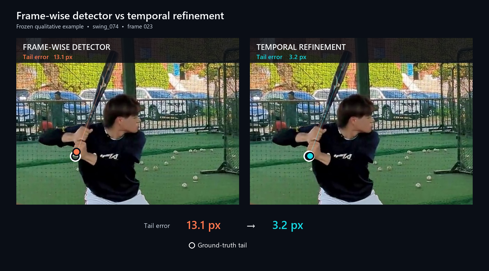
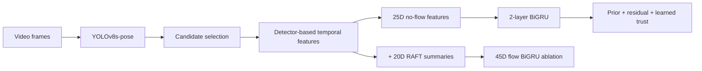
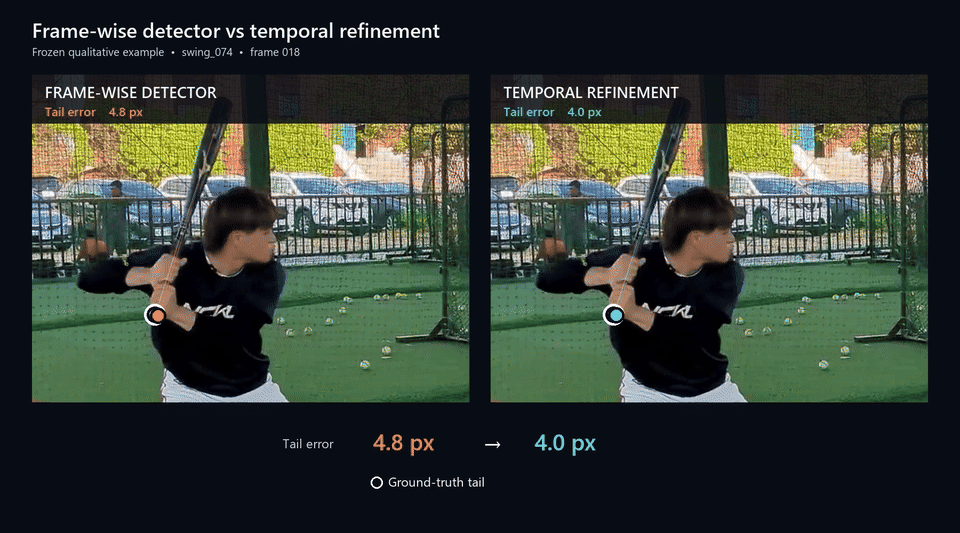
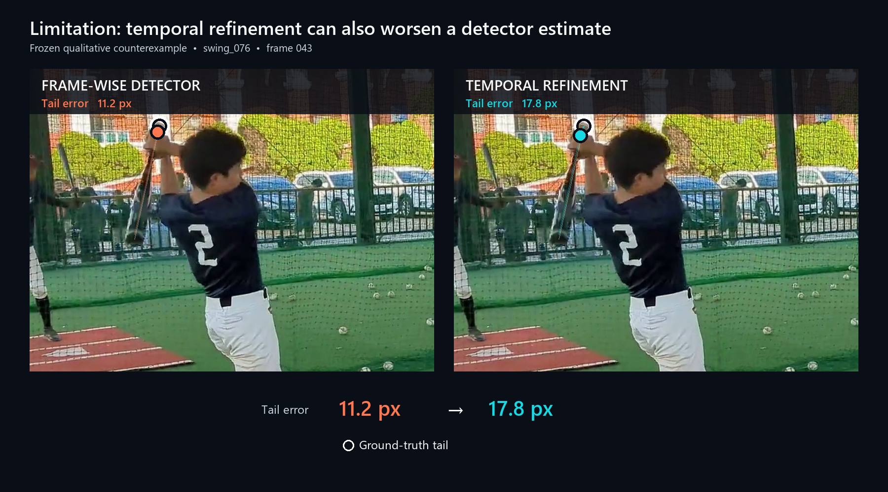

# Baseball Bat Keypoint Detection and Temporal Refinement



Locating the head and tail of a fast-moving bat is a difficult part of baseball swing analysis. A frame-wise detector works well on many frames, but occasional misses and large endpoint errors make the trajectory unreliable.

The original two-person course project focused on bat endpoint localization, especially the tail, under occlusion and unstable detections. Early work explored temporal information, optical flow, occlusion-aware augmentation, and visibility-aware training. The implementation gradually developed into a bidirectional gated recurrent unit (BiGRU) temporal refiner using 31-frame windows.

After the course project, I audited the feature pipeline and rebuilt it using only information available at inference time. In the later reconstruction, I tested whether temporal context actually reduced detector errors and whether RAFT added useful information beyond coordinate-based motion.

Temporal refinement mainly reduced large detector errors, while threshold-based accuracy improved only slightly. Adding optical flow made little additional difference.

## Method Overview



- **Detector:** YOLOv8s-pose followed by deterministic candidate selection using confidence, temporal/geometric consistency, and outlier rejection.
- **Temporal input:** 25 features from detector coordinates, confidence, validity, geometry, motion, and available view metadata. The temporal model uses only detector-derived features available at inference time.
- **Model:** The temporal refiner is a two-layer BiGRU that processes 31-frame windows. It learns how to correct the detector output and how strongly to trust that correction. Predictions from overlapping windows are averaged.
- **Flow ablation:** the same model and real-data training recipe, with 20 RAFT summary features added to form a 45D input.

The BiGRU uses past and future frames, so this is an **offline** method.

To get more training motion data, I used the [OpenBiomechanics Project (OBP) — Baseball Hitting](https://github.com/drivelineresearch/openbiomechanics) dataset from Driveline Baseball R&D. I projected the 3D bat trajectories into different 2D camera views, added detector-like noise and missing observations, and used these sequences to pretrain the temporal model before fine-tuning on real detector outputs.

Training also used auxiliary losses related to bat geometry and temporal consistency. More details are in [METHOD.md](docs/METHOD.md).

## Dataset

The dataset contains 79 swing videos annotated with bat bounding boxes, head/tail keypoints, and endpoint visibility labels.

Train, validation, and test sets are split by swing to avoid sequence overlap:

| Split | Swings | Frames
|---|---:|---|
| Train | 53 | 4,201 |
| Validation | 11 | 646 |
| Test | 15 | 875 |

Training uses three-fold out-of-fold detector predictions. Validation alone selects the checkpoint; test data is used for the final evaluation.

The original source videos, private annotations, detector/flow exports, OBP C3D and derived trajectory datasets, and model weights are not included. The examples below use self-recorded footage shared with permission.

## Results

The table compares tail localization on the same 840 test frames where valid ground truth and detector predictions were available. The baseline is the frame-wise detector **after deterministic candidate selection**, rather than raw YOLO rank-1 output.

The table uses the same 840 frames for all three methods so that their localization errors can be compared directly.

Metrics:
RMSE, mean, median, and P90 measure tail error in pixels; lower is better. PCK measures how often tail error stays within a fraction of each swing’s reference bat length—5% for PCK@5 and 2.5% for PCK@2.5. AUC summarizes PCK across thresholds from 0% to 10%; higher is better.

| Pipeline | RMSE ↓ | Mean error ↓ | Median ↓ | P90 ↓ | PCK@2.5 ↑ | PCK@5 ↑ | AUC [0, 10%] ↑ |
|---|---:|---:|---:|---:|---:|---:|---:|
| Frame-wise detector after deterministic candidate selection | 19.956 px | 11.590 px | 6.094 px | 29.290 px | 67.26% | 82.62% | 0.7250 |
| Temporal refinement, no optical flow | **17.278 px** | **10.714 px** | **5.821 px** | **26.671 px** | 68.33% | **83.33%** | 0.7346 |
| Temporal refinement + RAFT optical flow | **17.177 px** | **10.684 px** | 5.951 px | **26.503 px** | **68.45%** | **83.33%** | **0.7350** |

No-flow refinement reduced RMSE by **13.42%**, mean error by **7.56%**, and P90 by **8.94%**. PCK gains were smaller: +1.07 percentage points at 2.5% and +0.71 at 5%.

The largest improvements came from severe detector errors. Predictions already within 5 px became slightly worse on average. The model behaved mainly as a **temporal outlier corrector**, with benefits and regressions across frames.

Adding RAFT optical-flow features reduced RMSE by only another 0.58%, increased PCK@2.5 by 0.12 percentage points, and left PCK@5 unchanged.

Detailed aggregate metrics are available in [final_metrics.json](results/final_metrics.json).

## Examples

### Improvement



The animation compares the frame-wise detector with temporal refinement over a representative swing segment.

In the representative improvement example, tail error decreases from **13.1 px → 3.2 px** with no-flow refinement.

- [Higher-quality short MP4](docs/demo_assets/swing074_detector_vs_temporal.mp4)
- [Full-swing comparison video](docs/demo_assets/swing074_full_swing_comparison.mp4)

Both use the same fixed crop and saved predictions. Playback speed is chosen for presentation; it is not capture speed or inference throughput.

### Limitation example



In this limitation example, tail error increases from **11.2 px → 17.8 px**. Refinement does not improve every estimate.

These are qualitative examples. The aggregate 15-swing evaluation is the basis for the performance results.

## Contributions

I primarily worked on the YOLO pipeline, dataset preparation and splits, synthetic 3D-to-2D data generation, temporal refinement, RAFT integration, and experiment analysis. I also contributed to video preprocessing and manual annotation.

My project teammate trained the HRNet baseline and contributed to annotation, poster preparation, and result organization.

## Verification

The core implementation has been validated with the included tests:
```bash
python -m pip install -r requirements-dev.txt
python -m pytest
```
The current public suite passes 38/38 tests in the verified Python 3.11 environment.
Optional dependencies for synthetic preprocessing, optical flow, and demo rendering are documented in [Dependencies](docs/DEPENDENCIES.md).

## Limitations

- The final evaluation uses a small dataset: 15 test swings and one seed.
- Bidirectional windows make the refiner offline.
- Large-error improvements do not translate into equally large PCK gains, and already-accurate predictions can worsen.
- Flow adds little accuracy in this experiment; results do not show an occlusion-specific solution.
- The real-data experiments cannot be reproduced from this repository alone because the private dataset and model checkpoints are not included.

## Detailed documentation

- [Method](docs/METHOD.md): how the temporal model and features work
- [Reproducibility](docs/REPRODUCIBILITY.md): how the data, training, evaluation, and demos are organized
- [Input schemas](docs/INPUT_SCHEMAS.md): expected input formats for detector, annotation, and flow data
- [Dependencies](docs/DEPENDENCIES.md): which packages are needed for each part of the project
- [Configs](configs/): settings used in the final experiments
- [Third-party sources](docs/THIRD_PARTY_ATTRIBUTION.md): external datasets, tools, and licensing notes
